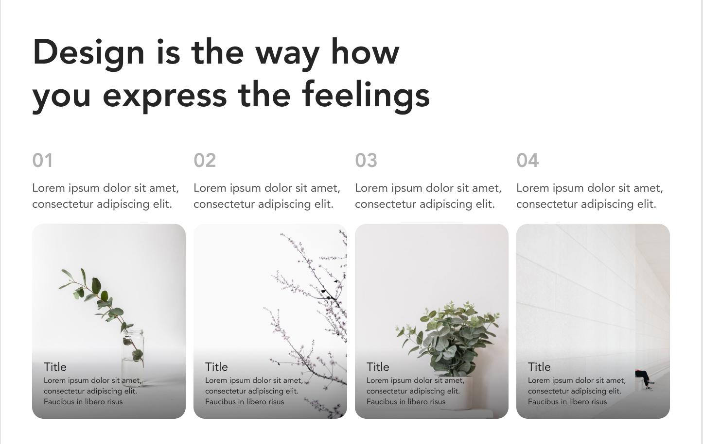

# 🌐 Responsive Landing Page 08

This is a fully responsive landing page built using **HTML5** and **CSS3**. It’s part of my ongoing journey to improve my UI/UX and frontend development skills as a full-stack developer.

---

## ✨ Key Focus Areas

🧠 Mobile-first design strategy  
🧠 Semantic and accessible HTML  
🧠 CSS Flexbox & Grid Layouts  
🧠 Smooth responsive behavior across all screen sizes  

---

## 📱 Responsive Breakpoints

✅ Desktop: 1440px and above  
✅ Tablet: 768px to 1024px  
✅ Mobile: 500px and below  

---

## 🧠 What I Practiced & Learned

🎯 Structuring pages using semantic HTML  
🎯 Designing flexible layouts using Flexbox & Grid  
🎯 Writing clean, scalable, and maintainable CSS  
🎯 Using media queries for seamless responsiveness  
🎯 Enhancing visual hierarchy and spacing  

---

## 💻 Tech Stack

- HTML5  
- CSS3  

---

## 📸 Preview

---

## 🔗 Live Demo

👉 [Click here to view live](https://waqaswebsolutions.github.io/responsive-landing-page-08/)

> 💡 Replace the link above with your deployed live version once available.

---

## 📂 Project Structure

responsive-landing-page-03/
├── index.html
├── style.css
├── Images/
└── README.md

---

## 📌 Note

This is a practice project built to enhance my frontend design skills. Feedback and suggestions are always welcome!

---

## 🧑‍💻 Made with 💙 by [Waqas Web Solutions](https://github.com/waqaswebsolutions)
